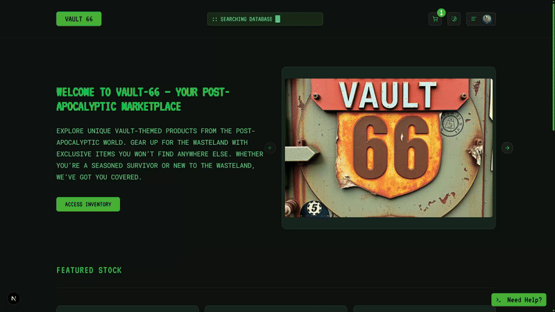
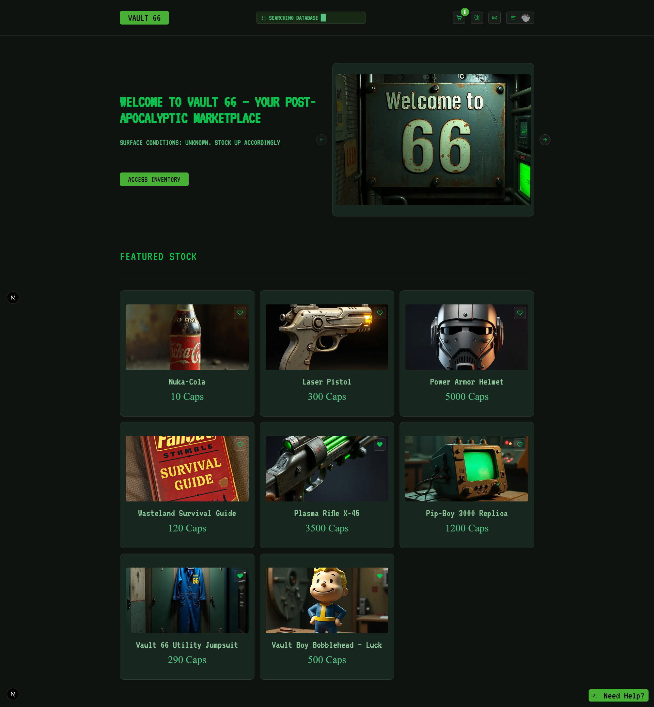
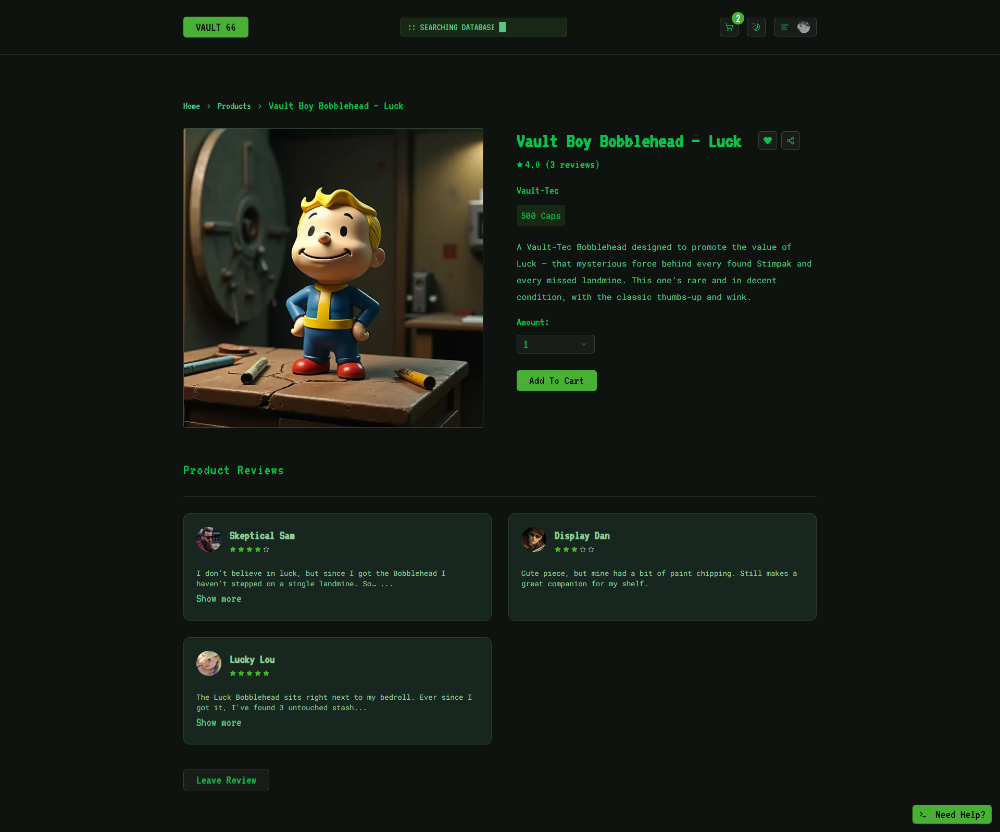
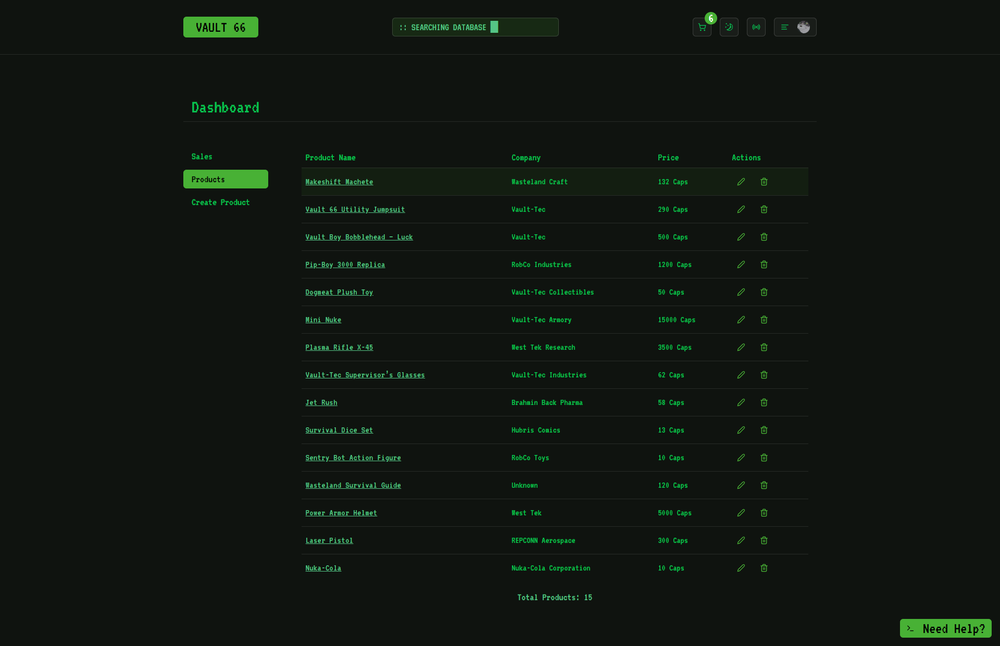
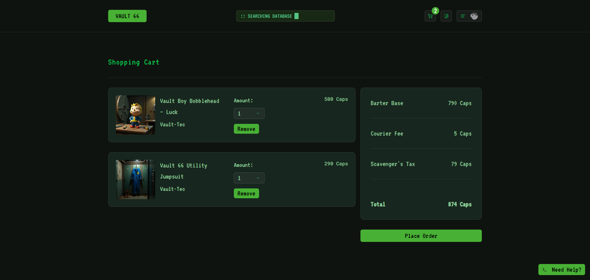

# Vault 66 Store

A Fallout-inspired e-commerce store built with modern full-stack tools and a retro-futuristic UI.  
Buy Wasteland gear with bottle caps, chat with a terminal–styled AI assistant, and manage store inventory with an intuitive admin dashboard.

---

## 🔴 Live Demo

➡️ [https://vault-66-store-maksym-dombrovs-projects.vercel.app/](https://vault-66-store-maksym-dombrovs-projects.vercel.app/)

---

## 🤖 AI Assistant Showcase



## 💪 S.P.E.C.I.A.L. Showcase


## 🧠 Hacking Minigame Showcase


---

## 🔐 Test Admin Access

You can log in as a test admin to explore the full admin dashboard (product creation, deletion, etc.).

**Test Admin Credentials:**  
Email: controlvault66@gmail.com  
Password: vaultcontrol66!

---

## ✨ Features

- 🔐 **Clerk Auth Integration**

  - Role-based access with users, main admin, and a test admin
  - Route protection handled via `clerkMiddleware`

- 🛒 **E-Commerce Functionality**

  - Fallout-themed product catalog with immersive bottle cap pricing
  - Add items to Favorites
  - Leave reviews and check your order history
  - Full browse → checkout → track flow

- 💳 **Stripe Integration**

  - Integrated with Stripe for secure payments
  - Test mode supported for development/demo

- 🧠 **AI Assistant**

  - Fallout-style terminal UI powered via OpenRouter API
  - Provides smart, lore-friendly in-universe responses

- 📦 **Admin Dashboard**

  - Create, edit, and delete products with secure access
  - Test admin role is restricted from modifying products they didn’t create

- 🌗 **Theming**

  - Toggle between Fallout 3–style green and New Vegas–style amber
  - Accessible right from the navbar

- 📻 **Fallout.FM Radio Integration**

  - Immerse yourself in the world of Fallout with a live-streamed in-universe radio station
  - Accessible via the navbar for ambient Wasteland vibes while you shop

- 🖼️ **Supabase Storage**

  - Securely upload and manage product images via Supabase bucket

- 🛡️ **Form Validation with Zod**
  - Schema-safe forms with reusable components
  - Built with Zod for consistent client/server validation

---

## 🧍‍♂️ Character System

Manage user profiles and personalize each experience through Fallout-inspired features:

- 📇 **User Profile**  
  View your S.P.E.C.I.A.L. allocation and quiz results  
  Profile data is saved per account and reflects updates in real time

- 📊 **S.P.E.C.I.A.L. Attributes**  
  Allocate points across Fallout’s core stats

- 🧪 **G.O.A.T. Quiz**  
  Vault-Tec–style personality quiz to tag your skills

- 💻 **Hacking Minigame**  
  Terminal-style word puzzle inspired by Fallout’s hacking mechanic  
  Offers an immersive mini-game experience within the profile section

---

## 🖼️ Screenshots

### 🏪 Home Page



### 📦 Product Page



### ⚙️ Admin Dashboard



### 🛒 Cart Page



---

## 🧪 Tech Stack

| Tech                | Purpose                                                       |
| ------------------- | ------------------------------------------------------------- |
| Next.js 15          | Core of the app — routing, server-side logic, and rendering   |
| Tailwind CSS        | Fast and flexible styling using utility classes               |
| ShadCN UI           | Reusable, accessible components                               |
| Prisma + PostgreSQL | Database layer for managing products, cart, reviews, orders   |
| Clerk               | Handles authentication and user roles (regular users, admins) |
| Stripe              | Checkout and payments — supports test cards out of the box    |
| Supabase            | Stores and serves product images via bucket storage           |
| Zod                 | Validates forms and inputs to keep everything type-safe       |
| OpenRouter          | Powers the in-universe AI assistant (uses GPT-4o mini)        |
| Framer Motion       | Used for animations, mostly for profile section               |

---

## 🛠️ Getting Started

To run this project locally, follow these steps:

### Clone the repository and install dependencies:

```bash
git clone https://github.com/mdombrov-33/vault-66-store.git
cd vault-66-store
npm install
```

### Create a .env file from the example

```bash
cp .env.example .env
```

Open .env and fill in your own API keys and secrets (e.g. for Clerk, Stripe, Supabase, OpenRouter, etc.).

⚠️ Without valid credentials, some features like authentication, checkout, and AI chat won't work.

### Then run the development server:

```bash
npm run dev
```

---

## 🐳 Running with Docker

If you want to run the app without installing dependencies locally, you can use the official Docker image.

### Pull the latest image:

```bash
docker pull vexenbay/vault-66:latest
```

### Run the container:

```bash
docker run -p 3000:3000 --env-file .env vexenbay/vault-66:latest
```

Then open http://localhost:3000 in your browser.

---

## 🌐 Environment Variables

Make sure to fill in the following environment variables in your `.env` file:

| Variable                             | Purpose                                               |
| ------------------------------------ | ----------------------------------------------------- |
| `SUPABASE_URL`                       | Supabase project URL for image storage                |
| `SUPABASE_KEY`                       | Supabase public API key                               |
| `DATABASE_URL` / `DIRECT_URL`        | PostgreSQL DB URLs (with password inserted)           |
| `DBPASSWORD`                         | Raw Supabase DB password (used in connection strings) |
| `NEXT_PUBLIC_CLERK_PUBLISHABLE_KEY`  | Clerk public key for frontend auth                    |
| `CLERK_SECRET_KEY`                   | Clerk secret key for server-side auth                 |
| `ADMIN_USER_ID`                      | Main admin Clerk user ID                              |
| `TEST_ADMIN_USER_ID`                 | Test admin Clerk user ID (has limited permissions)    |
| `OPENROUTER_API_KEY`                 | API key for GPT-based AI assistant via OpenRouter     |
| `NEXT_PUBLIC_STRIPE_PUBLISHABLE_KEY` | Stripe key for checkout UI                            |
| `STRIPE_SECRET_KEY`                  | Stripe secret key for server-side payment handling    |
| `NEXT_PUBLIC_WEBSITE_URL`            | Deployed frontend URL (used in share links, etc.)     |

---

Thank you for checking out Vault 66 Store!  
Happy shopping in the Wasteland. 💚
