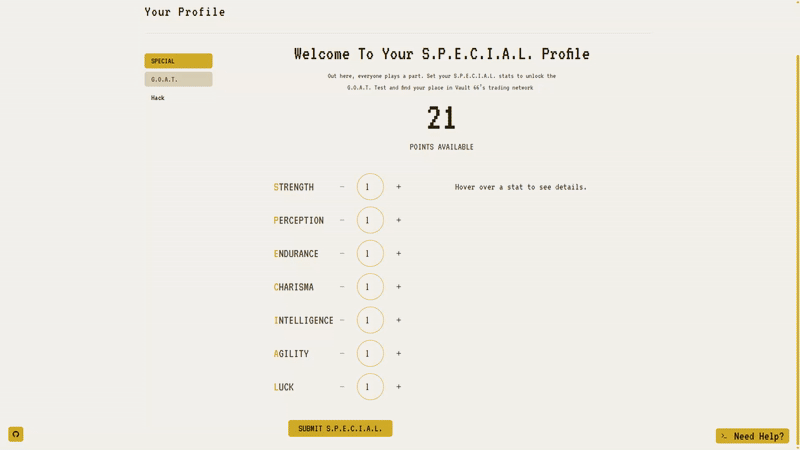
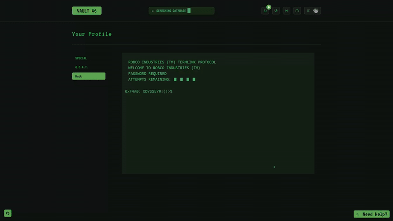

      

# Vault 66

A full-stack Fallout experience with shopping, AI conversations, lore-driven mini-games, and personalized character progression — all powered by modern tech and Wasteland flavor.

---

## 🔴 Live Demo

➡️ [https://vault-66.vercel.app/](https://vault-66.vercel.app/)

---

## 🤖 AI Assistant Showcase


## 💪 S.P.E.C.I.A.L. Showcase



## 🧠 Hacking Minigame Showcase



---

## 🔐 Test Admin Access

You can log in as a test admin to explore the full admin dashboard (product creation, deletion, etc.).

**Test Admin Credentials:**  
Email: controlvault66@gmail.com  
Password: vaultcontrol66!

---

## ✨ Features

- 🔐 **Clerk Auth Integration**

  - Role-based access with regular users, main admin, and a test admin
  - Route protection handled via `clerkMiddleware`

- 🛒 **E-Commerce Functionality**

  - Fallout-themed product catalog with immersive bottle cap pricing
  - Add items to Favorites
  - Leave reviews and check your order history
  - Full browse → checkout → track flow

- 💳 **Stripe Integration**

  - Integrated with Stripe for secure payments
  - The test admin role is restricted from modifying products they did not create

- 🧠 **AI Assistant**

  - Fallout-style terminal UI powered via OpenRouter API
  - Provides smart, lore-friendly in-universe responses

- 💬 **Live Chat System**

  - Real-time, lore-friendly chat with a terminal-inspired UI
  - Powered by Socket.IO for smooth communication

- 📦 **Admin Dashboard**

  - Create, edit, and delete products with secure access
  - Test admin role is restricted from modifying products they didn’t create

- 🌗 **Theming**

  - Toggle between Fallout 3–style green and New Vegas–style amber
  - Accessible right from the navbar

- 📻 **Fallout.FM Radio Integration**

  - Immerse yourself in the world of Fallout with a live-streamed in-universe radio station
  - Accessible via the navbar for ambient Wasteland vibes while you shop

- 🖼️ **Supabase Storage**

  - Securely upload and manage product images via Supabase bucket

- 🛡️ **Form Validation with Zod**
  - Schema-safe forms with reusable components
  - Built with Zod for consistent client/server validation

---

## 🧍‍♂️ Character System

Manage user profiles and personalize each experience through Fallout-inspired features:

- 📇 **User Profile**  
  View your S.P.E.C.I.A.L. allocation and quiz results  
  Profile data is saved per account and reflects updates in real time

- 📊 **S.P.E.C.I.A.L. Attributes**  
  Allocate points across Fallout’s core stats

- 🧪 **G.O.A.T. Quiz**  
  Vault-Tec–style personality quiz to tag your skills

### 🎮 Mini-Games

- 💻 Hacking Minigame  
  Terminal-style word puzzle inspired by Fallout’s hacking mechanic  
  Offers an immersive mini-game experience within the profile section

- 🗝️ **Lockpicking Minigame**  
  Practice your lockpicking skills with a Fallout-inspired challenge  
  Use mouse and keyboard controls to find the correct pin angle and crack the lock

---

## 🖼️ Screenshots

### 🏪 Home Page


### 📦 Product Page


### ⚙️ Admin Dashboard


### 🛒 Cart Page


---

## 🧪 Tech Stack

| Tech                | Purpose                                                       |
| ------------------- | ------------------------------------------------------------- |
| Next.js 15          | Core of the app — routing, server-side logic, and rendering   |
| Tailwind CSS        | Fast and flexible styling using utility classes               |
| ShadCN UI           | Reusable, accessible components                               |
| Prisma + PostgreSQL | Database layer for managing products, cart, reviews, orders   |
| Clerk               | Handles authentication and user roles (regular users, admins) |
| Stripe              | Checkout and payments — supports test cards out of the box    |
| Supabase            | Stores and serves product images via bucket storage           |
| Zod                 | Validates forms and inputs to keep everything type-safe       |
| OpenRouter          | Powers the in-universe AI assistant (uses GPT-4o mini)        |
| Framer Motion       | Used for animations, mostly for profile section               |

---

## 🛠️ Getting Started

To run this project locally, follow these steps:

### Clone the repository and install dependencies:

```bash
git clone https://github.com/mdombrov-33/vault-66-store.git
cd vault-66-store
npm install
```

### Create a .env file from the example

```bash
cp .env.example .env
```

Open .env and fill in your own API keys and secrets (e.g. for Clerk, Stripe, Supabase, OpenRouter, etc.).

⚠️ Without valid credentials, some features like authentication, checkout, and AI chat won't work.

### Then run the development server:

```bash
npm run dev
```

---

## 🐳 Running with Docker

⚠️ Important: Regardless of whether you run with Docker Compose or pull and run the Docker image manually, you need to create and fill your own .env file with the required environment variables before starting the app. Without valid environment variables, features like authentication, payments, and AI chat won’t work.

### 1. Run with Docker Compose

`docker-compose.yml` is already configured, so simply run:

```bash
docker-compose up
```

This will build (if necessary) and start the container, mapping ports and loading your environment variables as configured.

Open http://localhost:3000 in your browser to access the app.

To stop the container, press `Ctrl+C` or run:

```bash
docker-compose down
```

### 2. Pull and run the image manually

If you want to use the pre-built official image without Docker Compose, run:

```bash
docker pull vexenbay/vault-66:latest
```

Then start the container:

```bash
docker run -p 3000:3000 --env-file .env vexenbay/vault-66:latest
```

Open http://localhost:3000 in your browser.

To stop the container, press `Ctrl+C`.

---

## 🌐 Environment Variables

Make sure to fill in the following environment variables in your `.env` file:

| Variable                             | Purpose                                               |
| ------------------------------------ | ----------------------------------------------------- |
| `SUPABASE_URL`                       | Supabase project URL for image storage                |
| `SUPABASE_KEY`                       | Supabase public API key                               |
| `DATABASE_URL` / `DIRECT_URL`        | PostgreSQL DB URLs (with password inserted)           |
| `DBPASSWORD`                         | Raw Supabase DB password (used in connection strings) |
| `NEXT_PUBLIC_CLERK_PUBLISHABLE_KEY`  | Clerk public key for frontend auth                    |
| `CLERK_SECRET_KEY`                   | Clerk secret key for server-side auth                 |
| `ADMIN_USER_ID`                      | Main admin Clerk user ID                              |
| `TEST_ADMIN_USER_ID`                 | Test admin Clerk user ID (has limited permissions)    |
| `OPENROUTER_API_KEY`                 | API key for GPT-based AI assistant via OpenRouter     |
| `NEXT_PUBLIC_STRIPE_PUBLISHABLE_KEY` | Stripe key for checkout UI                            |
| `STRIPE_SECRET_KEY`                  | Stripe secret key for server-side payment handling    |
| `NEXT_PUBLIC_WEBSITE_URL`            | Deployed frontend URL (used in share links, etc.)     |

---

## 🎵 Wasteland Sound & Music Archives

The sounds that bring Vault 66 to life come from various public sources, grouped by their role in the app:

### 🔐 Lockpicking Sounds

Tense clicks and clacks for the lockpick minigame:  
[Fallout Lockpicking Sounds Repo](https://github.com/afenkurtz/FalloutLockPicking)

### 🎶 Global Sounds

Typing, UI interactions, notifications, and other global sound effects:  
[Global Sound Effects Repo](https://github.com/jabbalaci/keysound)

### 📻 Fallout Radio Stream

An endless Fallout-themed radio broadcast streaming live:  
[Fallout Radio Station](https://fallout.fm/)

---

Thank you for checking out Vault 66!
Happy shopping in the Wasteland. 💚
